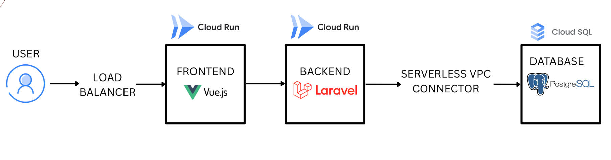
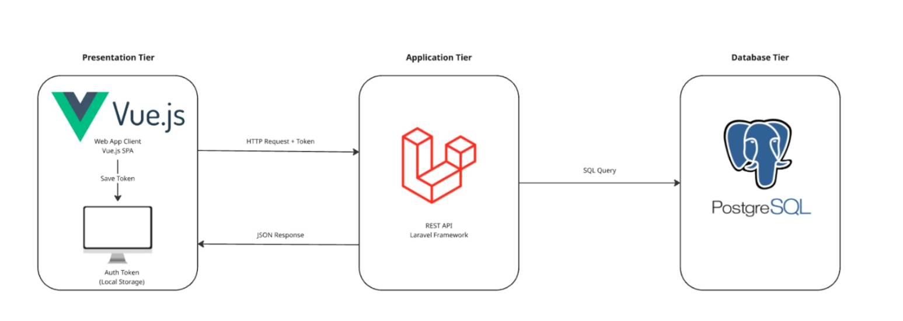

# Dokumentasi Arsitektur Kantin RK ITERA

Dokumen ini merangkum arsitektur yang diterapkan pada aplikasi Kantin RK ITERA. Struktur dibagi dua bagian utama:
- **Arsitektur GCP**: penempatan workload dan konektivitas di Google Cloud.
- **Arsitektur Sistem**: susunan komponen aplikasi (frontend, backend, dan database) beserta alur komunikasinya.

## ☁️ Arsitektur GCP

 - **Load Balancer (HTTPS)**: IP statis untuk DNS; meneruskan trafik hanya ke Cloud Run Frontend (sesuai diagram).
 - **Cloud Run Frontend**: Vue.js + Nginx; men-serve UI dan memanggil REST API Cloud Run Backend via HTTPS.
 - **Cloud Run Backend**: Laravel API; menerima request dari Frontend dan mengakses database melalui **Serverless VPC Connector** (private).
 - **Cloud SQL (PostgreSQL)**: basis data terpusat; diakses hanya oleh Backend melalui Serverless VPC Connector; tidak diekspos ke internet.

### Ringkasan Alur
1. Pengguna membuka domain yang mengarah ke IP HTTPS Load Balancer.
2. Load Balancer meneruskan trafik ke layanan Cloud Run Frontend.
3. Frontend menjalankan Google Sign-In via Firebase Auth dan menyimpan ID token di sisi client.
4. Frontend memanggil REST API Cloud Run Backend melalui HTTPS sambil mengirim header `Authorization: Bearer <token>`.
5. Backend memvalidasi token, menjalankan logika bisnis, dan mengakses Cloud SQL (PostgreSQL) melalui koneksi privat.
6. Backend mengembalikan HTTP JSON response ke frontend untuk ditampilkan kepada pengguna.

## 🏛️ Arsitektur Sistem (3-Tier)

### Presentation Tier
- Web App (Client) sebagai antarmuka pengguna.
- Firebase Auth untuk Google Sign-In menghasilkan ID Token.
- Token digunakan sebagai Bearer untuk mengakses API backend.

### Application Tier
- Backend menggunakan Laravel (PHP) dan Sanctum.
- Menyediakan RESTful API.
- Menerima token dari frontend untuk proses autentikasi/otorisasi.

### Database Tier
- PostgreSQL sebagai basis data utama (Cloud SQL).
- Backend melakukan SQL Query ke database dan menerima hasilnya untuk dikembalikan ke frontend.

## 🔄 Alur Komunikasi Utama

1. Client melakukan login dengan Google melalui Firebase Auth.
2. Client menerima ID Token dan mengirim HTTP Request (REST API) ke backend dengan Bearer token.
3. Backend memproses request dan melakukan query ke PostgreSQL.
4. Backend mengembalikan HTTP JSON Response ke client.

## 🗂️ Ringkasan Stack Teknologi

| Layer | Teknologi | Peran |
|-------|-----------|-------|
| Presentation | Vue 3, TypeScript, Vite, Axios | SPA, HTTP client |
| Identity (client) | Firebase Authentication | Google Sign-In, ID token |
| Application | Laravel 12, PHP 8.2, Sanctum, Spatie Permission | REST API, auth, RBAC |
| Database | Cloud SQL (PostgreSQL) | Penyimpanan terpusat |
| Infrastruktur | Cloud Run, HTTPS Load Balancer, Cloud Build, Nginx | Hosting container, IP publik, CI/CD |
| DevOps | Docker, Git | Packaging, version control |

